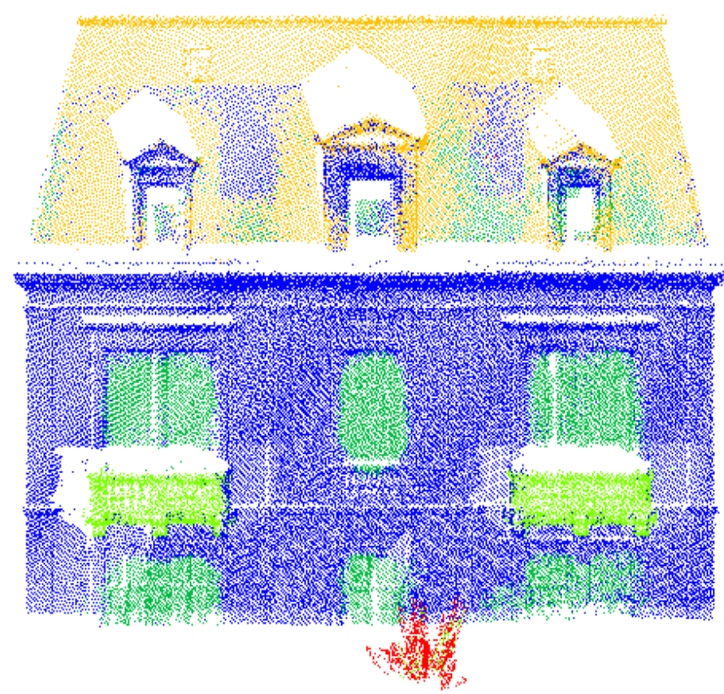

# PFE_2021 : PointNet++ Pytorch Implementation  

TO DO LIST : 

- Relire 
- Mettre un lien vers le rapport de PFE et le poster 
- Faire un script spécial pour test indiv ?

## About the repo

This repo is an implementation for [PointNet++](https://proceedings.neurips.cc/paper/2017/file/d8bf84be3800d12f74d8b05e9b89836f-Paper.pdf) in PyTorch, based on [yanx27](https://github.com/yanx27/Pointnet_Pointnet2_pytorch) repo. 

## About the project (Detection of openings by semantic segmentation of 3D indoor/outdoor point clouds: contribution of deep learning)

The goal of the project is to segment point clouds of buildings with the PointNet ++ neural network, and to focus on the results obtained on the classes of openings (windows and doors) in order to automate the Scan-to-BIM process. It's a project realized for my end of study internship to obtain my engineering diploma at INSA (National Institute of Applied Sciences) of Strasbourg. This internship was carried out in the TRIO team of the ICube laboratory and was directed by Tania LANDES. For more information about the project, you can read my master thesis [put the link].


## Install 

The latest codes are tested on Window 10, CUDA 11.1, PyTorch 1.6 and Python 3.8. 

To run the codes, you also need some GPU devices (the one use for the project is NVIDIA GeForce GTX 1070 with 16 Go of dedicated memory). In order to use the GPU with Python, you also need to install : 
- **NVIDIA Driver** for your GPU (you can find it in [NVIDIA's website](https://www.nvidia.com/Download/index.aspx?lang=en-us))
- **CUDA Toolkit** (you can find the CUDA Toolkit Archive [here](https://developer.nvidia.com/cuda-toolkit-archive). Be sure to check the CUDA Toolkit version that PyTorch currently supports. You can find that information on PyTorch's site).
- **cuDNN library** (navigate again in [NVIDIA's website](https://developer.nvidia.com/cudnn). Choose to download the version of cuDNN that corresponds to the PyTorch-supported version of the CUDA Toolkit that you downloaded in the last step).
- You can check if python is using your GPU devices with this code : 
```
import torch
torch.cuda.is_available()
```
For more information, you can refer to [this](https://www.youtube.com/watch?v=IubEtS2JAiY&t=766s) youtube video.

## Using the implementation for point clouds semantic segmentation

### Data preparation 

- Your point clouds must be .txt files of the form ```X Y Z Characteristics Label```. 
- The facades must be oriented according to the X and Y. I  recommend that you open them on **CloudCompare** software, which you can download for free [here](http://www.danielgm.net/cc/release/) as a precautionary measure. 
- Your data must be splited into 3 folders named **Training**, **Validation** and **Test** in ```data```. Make sure that a point cloud does not appear twice in different folders. Some examples of point clouds are provided in this repo. 

If you want to use your own dataset to train and test PointNet++, you also need to adapt the script *dataloader_vigo_thermique_rgb.py* that you can find at ```data_utils/dataloader_vigo_thermique_rgb.py```. The changes you have to make are notified by the sign /!\\. Please read carefully the comments to avoid making mistakes.

### Run 

- To start your training and test your neural network, you must run the script *train_test_sem_seg.py*. 
- If you are using your own data, you also have to do some changes on the code, which are notified by the sign /!\\. 
- After processing, you can find the journal of your training at ```log/sem_seg/yyyy-mm-dd_hh_mm/logs``` and check for quality criteria. 
- The graphs of the error and accuracy functions will be saved at ```log/sem_seg/yyyy-mm-dd_hh_mm/graphique```. 
- Visualization results will save in ```log/sem_seg/yyyy-mm-dd_hh_mm/visual```  and you can visualize these .txt file by CloudCompare.
- To launch another test of your model, you can also use the script *individual_semseg.py* 

### Performance

The databases used for the study are available here : VIGO Thermique [link], VIGO RGB [link] VIGO Thermique + 3D-FEAT [link], Musée Zoologique [Link].For more information about the databases, please check my master thesis [put the link].

Average results on cross-validation : 


|   | VIGO Thermique | VIGO RGB  | VIGO Thermique + 3D-FEAT | Musée Zoologique  | 
| ------------- | ------------- | ------------- | -------------| ------------- |
| IoU Window  | 0.42  | 0.21 | 0.33  | 0.52  | 
| mIoU  | 0.41  | 0.35  | 0.50  | 0.42  | 


## Visualization and results

Best segmentation results on a test point cloud of VIGO Thermique 




Best segmentation results on a test point cloud of Musée Zoologique


